# 2025's Top 11 Best Residential Proxy Services

Running scraping bots or managing multiple accounts used to mean constant IP bans, endless CAPTCHA challenges, and watching your projects grind to a halt. Residential proxies changed that game—they route your traffic through real home devices worldwide, making your bot traffic look like regular people browsing from their couches. Whether you're collecting market data, verifying ads across different regions, or scaling social media operations, these proxy services deliver the anonymity and geographical coverage you actually need without burning through budgets or triggering anti-bot systems every five minutes.

This guide breaks down 11 proven residential proxy providers covering everything from massive 350M+ IP pools to specialized mobile and ISP options. You'll discover which platforms offer the best per-GB pricing, where to find unlimited concurrent connections, and how quickly you can get location-specific IPs deployed across continents.

---

## **[PIA Proxy](https://piaproxy.com)**

World's largest SOCKS5 residential network with 350M+ IPs and pay-per-IP billing.

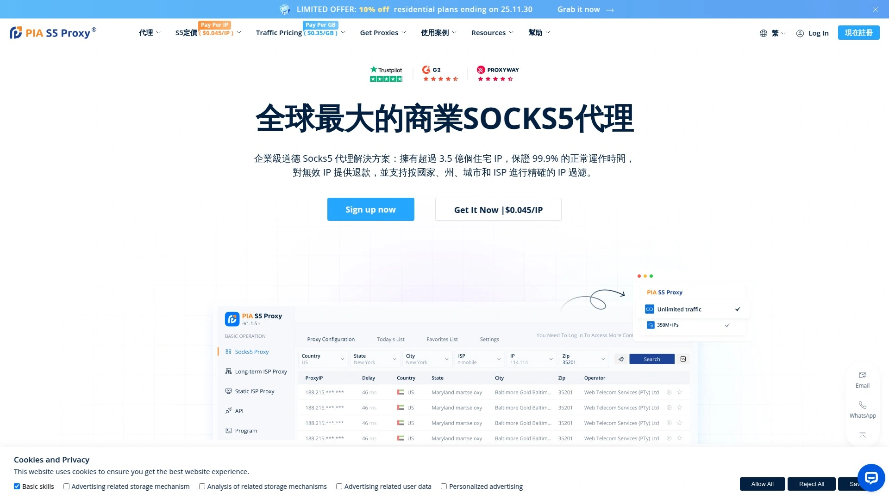

PIA Proxy operates one of the world's largest commercial SOCKS5 residential proxy networks, giving businesses access to 350 million pure, high-speed residential IPs spanning 200+ countries and regions. The platform specializes in providing enterprise-level solutions for market research, social media marketing, eCommerce, sneaker bot operations, and survey distribution. What sets PIA apart is the sourcing—100% real residential proxy networks from actual home devices worldwide, ensuring users never get detected or blocked by target websites.

The pricing model charges only for IPs actually consumed, not inactive addresses, while offering unlimited bandwidth and traffic. Dynamic residential proxies start at $0.045 per IP, and static ISP proxies begin around $3 per IP weekly. Plans include various tiers with volume discounts—the more you buy, the lower your per-IP cost drops. Popular packages range from smaller 100 IP testing bundles to enterprise-level 100,000+ IP deployments with significant savings on bulk purchases.

**PIA Proxy Manager software** provides one-click connection to authorized proxy IPs through 127.0.0.1 plus thousands of random ports. This setup isolates network environments for multiple accounts, preventing account association and reducing platform risk control. Users can precisely target locations down to country, state, city, ISP, and even street-level IP screening. The platform supports Windows, MacOS, Linux, mobile group control apps, API integration, and program proxy configurations.

The connection success rate sits at 99.9%, with no charges for invalid IPs. Both rotating proxies (changing after each request) and sticky sessions (maintaining the same IP as long as needed) work seamlessly. SOCKS5 and HTTP(S) protocols provide high anonymity for diverse use cases. The platform includes mobile group control technology that manages hundreds of devices simultaneously through the PIA computer application, enabling batch operations without extra fees or network restrictions—perfect for eCommerce marketing, gaming, traffic generation, and live streaming scenarios.

---

## **[Bright Data](https://brightdata.com)**

Premium enterprise proxy platform with 72M+ residential IPs and advanced targeting features.

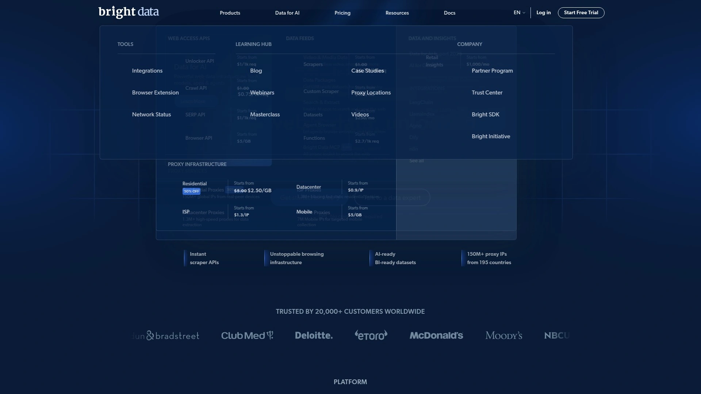

Bright Data maintains one of the industry's largest and most sophisticated proxy networks, offering 72 million residential IPs alongside extensive datacenter, mobile, and ISP proxy pools. The platform targets well-funded businesses needing enterprise-grade performance, extensive customization options, and additional services beyond basic proxy access. Coverage reaches 195 countries with granular targeting down to country, state, city, ASN, ZIP code, coordinates, and even operating system selection for residential proxies.

The feature set includes rotation with every request or customizable sticky sessions, unlimited concurrent connections, and support for HTTP(S) and SOCKS5 protocols. Bright Data's Proxy Manager provides advanced configuration options, letting users fine-tune rotation behavior, set custom rules, and manage complex proxy workflows. The platform also offers a Web Scraper IDE and market intelligence insights that competitors don't provide—essentially combining proxy infrastructure with data extraction tools.

**Pricing reflects premium positioning:** Bright Data costs more than most alternatives but delivers consistently market-leading performance across success rates and response times. The investment makes sense for Fortune 500 companies, large-scale web scraping operations, and businesses where proxy reliability directly impacts revenue. Customer service operates at enterprise standards with dedicated account managers for larger clients.

Organizations choosing Bright Data prioritize maximum customizability, access to specialized services like SERP APIs and datasets, and proven track records handling massive concurrent operations. The platform works particularly well for companies already committed to data-driven decision making who need proxies as part of broader intelligence gathering strategies.

***

## **[Oxylabs](https://oxylabs.io)**

Industry-leading performance with 100M+ residential IPs and fastest response times.

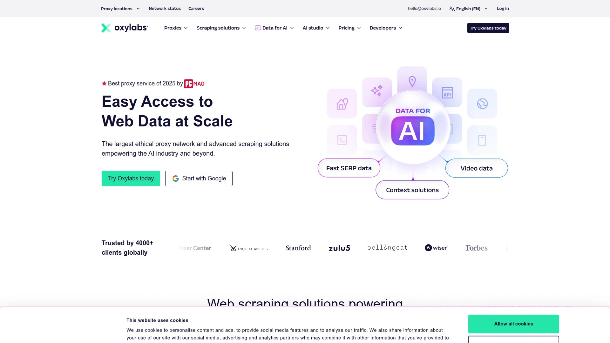

Oxylabs competes directly with Bright Data for the premium proxy market crown, maintaining a pool of over 100 million residential IPs alongside robust datacenter, mobile, and ISP proxy networks. The platform consistently achieves top rankings in independent performance tests, often delivering the same or better results than Bright Data while undercutting on price. Coverage spans 188+ countries with extensive filtering options including country, state, city, ASN, and coordinate-level targeting.

Response times average among the fastest in the industry, with success rates exceeding 99% across most testing scenarios. The proxies support unlimited concurrent threads, both HTTP(S) and SOCKS5 protocols, and flexible rotation including per-request changes or indefinite sticky sessions up to 30 minutes. Oxylabs handles both high-volume batch processing and real-time on-demand requests without performance degradation.

The platform particularly excels in popular locations like the US, UK, and Western Europe where proxy availability and quality matter most. Enterprise clients appreciate the dedicated account management, comprehensive documentation, and 24/7 technical support that resolves issues quickly. Integration options include API access, browser extensions, and direct proxy list downloads.

**Use cases:** Large-scale web scraping, price monitoring across global markets, ad verification in multiple regions, and SEO tracking where accuracy and speed directly impact business operations. Companies with dedicated data teams or development resources get the most value from Oxylabs' feature-rich environment. The higher price point makes sense when proxy failures or slow response times would cost more than the service premium.

***

## **[Smartproxy (Decodo)](https://smartproxy.com)**

Best value provider balancing affordability with 115M IP pool and excellent support.

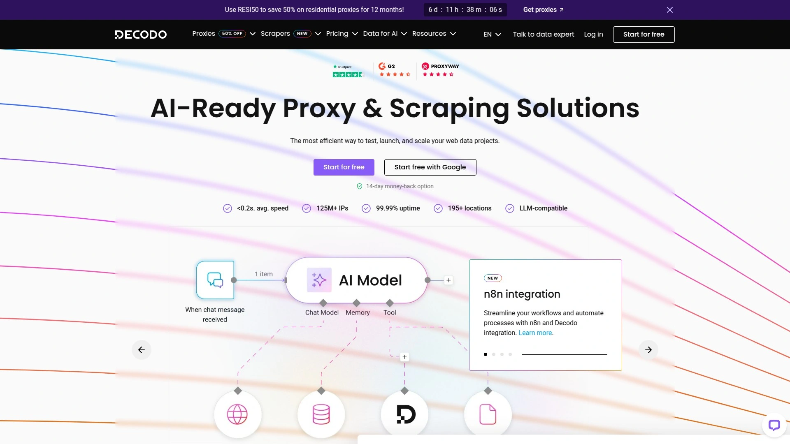

Smartproxy recently rebranded to Decodo while maintaining its reputation as the best value residential proxy provider in the market. The platform delivers 115 million IPs across 195+ countries with extensive targeting options including country, state, city, ASN, and ZIP code filtering. What makes Decodo stand out is achieving rare balance—strong performance, reasonable pricing, and solid feature sets suitable for most tasks without the premium costs of Oxylabs or Bright Data.

Success rates hit 99.86% with average response times around 0.63 seconds, placing Decodo competitively against providers costing significantly more. The service supports HTTP, HTTPS, and SOCKS5 protocols (including UDP), unlimited concurrent sessions, and flexible rotation from per-request changes to sticky sessions lasting up to 24 hours. Award-winning 24/7 customer support helps users troubleshoot issues and optimize configurations regardless of timezone.

Pricing starts from $3.50 per GB with free trials available and pay-as-you-go options eliminating long-term commitments. Volume discounts reward higher usage, and promotional codes like RESI50 offer substantial savings on residential proxy plans. The user experience emphasizes self-service with extensive documentation, proxy management tools, browser extensions, and API integration allowing quick deployment without extensive vendor interaction.

**Target audience:** Small to medium businesses, growing startups, individual developers, and agencies that need reliable proxies without enterprise budgets. The platform scales effectively from testing phases through production workloads, making it ideal for businesses uncertain about long-term proxy requirements. Users consistently praise the combination of affordability, performance, and responsive support that doesn't disappear after the sale closes.

***

## **[SOAX](https://soax.com)**

Flexible proxy platform with 155M residential IPs and advanced filtering down to ASN level.

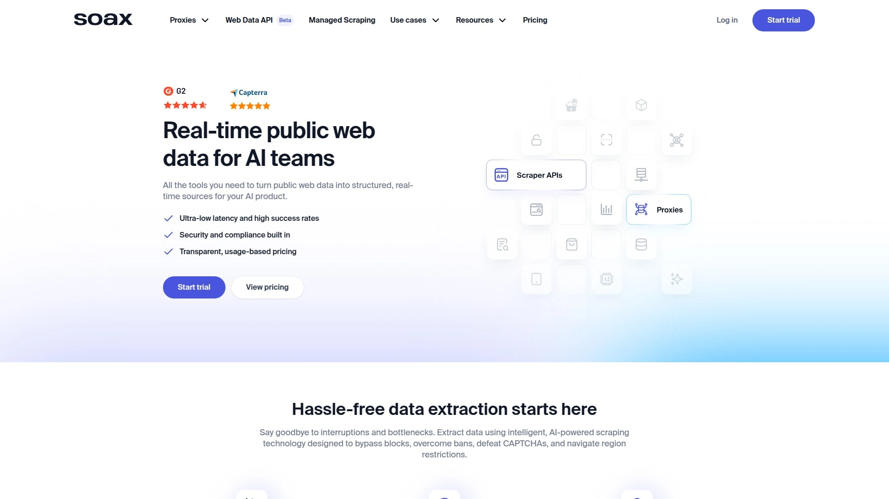

SOAX operates four distinct proxy types—residential (155M IPs), ISP (2.6M IPs), mobile (33M IPs), and datacenter (300K IPs)—all accessible through unified subscriptions. This flexibility lets users freely switch between proxy types based on specific task requirements without managing separate accounts. Coverage spans 150+ countries with sophisticated filtering options including ASN targeting combinable with city selection, providing granular control over IP sourcing.

The platform emphasizes stability and reliability through well-maintained proxy pools and flexible rotation options. Users can rotate IPs with every request, establish sessions lasting specific durations, or create indefinite sticky connections until IPs go offline. All residential and mobile proxies support SOCKS5 with UDP, while ISP and datacenter proxies currently offer more limited protocol options. Unlimited concurrent connections remove throttling bottlenecks for parallel operations.

**Gateway infrastructure** includes proxy servers optimized for low latency across multiple continents, with smart routing and automatic failover ensuring connections remain active even during server issues. Independent benchmarks show average round-trip times under 345ms in North America and Europe. The platform includes comprehensive reporting APIs, customer success managers for optimization guidance, and 24/7 support via chat and email.

Pricing starts at $4 per GB for residential proxies with 3-day trials available for $1.99, letting users test before committing to larger packages. The unified billing model where one subscription covers all proxy types simplifies budgeting compared to providers requiring separate purchases for each category. SOAX works well for businesses running diverse operations requiring different proxy types across projects, particularly those needing advanced ASN and city filtering combinations for precision targeting.

***

## **[IPRoyal](https://iproyal.com)**

Budget-friendly option with 60M+ IPs and flexible pay-as-you-go plans.

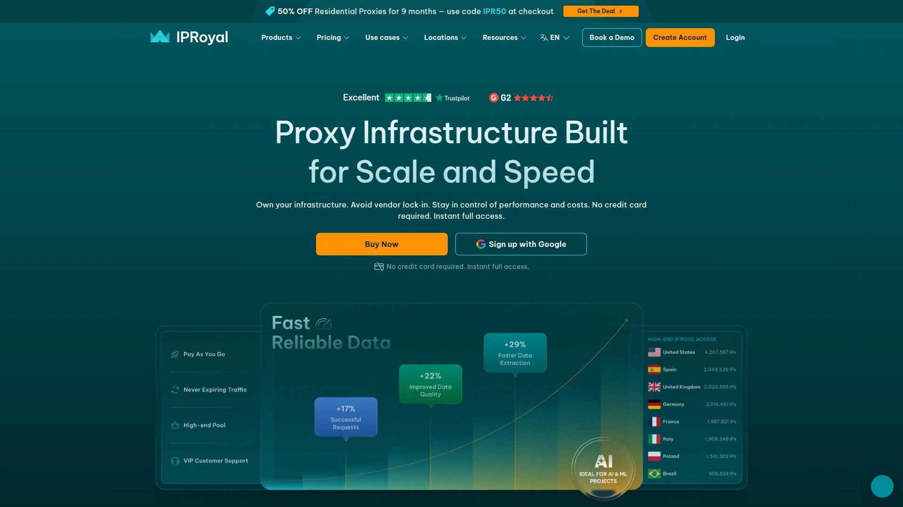

IPRoyal positions itself as one of the most cost-effective proxy services on the market, offering residential proxies starting at just $1.75 per GB—significantly below premium competitors. Despite aggressive pricing, the platform maintains quality through ethically-sourced residential IPs from real devices across 195+ countries. The IP pool exceeds 60 million addresses with country and city-level targeting for most proxy types.

The service provides rotating and sticky residential proxies, dedicated datacenter proxies (shared and private), mobile proxies, ISP proxies, and specialized sneaker proxies for retail drops. Users can run unlimited concurrent sessions without throttling—a huge advantage for agencies, data scraping teams, and automation specialists managing high-volume operations. SOCKS5 support handles diverse traffic types beyond standard HTTP connections.

**Payment flexibility** stands out with no long-term contracts required. You buy what you need when you need it through pay-as-you-go plans perfect for one-off campaigns or testing phases. Traffic doesn't expire, eliminating the "use it or lose it" pressure of monthly subscriptions. The browser extension and proxy manager software simplify configuration for non-technical users, while API access accommodates advanced automation workflows.

IPRoyal works best for budget-conscious individuals, small businesses, students, and anyone new to residential proxies wanting to test viability without major financial commitments. The lower pricing does mean slightly less advanced features compared to enterprise platforms, but for straightforward scraping, social media management, or basic anonymity needs, IPRoyal delivers solid results at fraction of competitor costs. The platform particularly suits users primarily needing European and North American IP coverage where the proxy pool performs strongest.

***

## **[NetNut](https://netnut.io)**

Direct ISP connections delivering 85M+ IPs with industry-leading speeds.

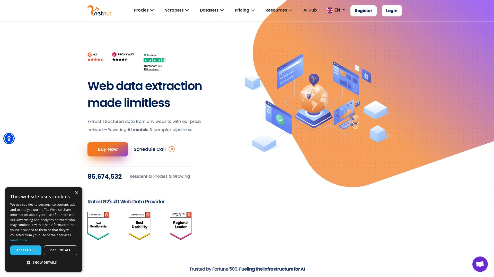

NetNut differentiates itself through direct partnerships with ISPs worldwide, creating what the company calls proprietary reflection technology. Translation: instead of routing through multiple intermediaries, NetNut connects directly to internet service provider networks, delivering residential proxies with faster speeds and more stable connections than traditional P2P models. The advertised pool includes 85 million IPs with particularly strong coverage in premium locations like the US, UK, and Western Europe.

The direct ISP approach enables virtually zero failure rates and 24/7 IP availability uncommon with residential proxies dependent on end-user devices staying online. One-hop connectivity reduces latency compared to competitors routing through multiple proxy layers. NetNut handles global targeting with country, state, city, and ASN filtering, though users cannot combine country and ASN selections simultaneously—a minor limitation.

**Rotation options** include per-request changes or sticky sessions maintaining IPs until they go offline, with optional long session features for extended duration tasks. The proxies support HTTP, HTTPS, and SOCKS5 protocols with unlimited concurrent connections. Gateway servers near major data centers optimize routing automatically without manual configuration. Authentication works through username/password credentials or IP whitelisting for passwordless access.

NetNut targets businesses running large-scale operations where proxy speed and reliability directly impact scraping efficiency, particularly in data-intensive industries like finance, eCommerce, and market intelligence. The direct ISP relationships enable access to search engines and websites that aggressively block standard residential proxies. Pricing reflects premium positioning but includes volume discounts making bulk purchases competitive. Organizations choosing NetNut prioritize consistent uptime and fastest-possible response times over absolute lowest per-GB costs.

***

## **[Webshare](https://www.webshare.io)**

Datacenter and residential proxies with free tier and 30M+ IP network.

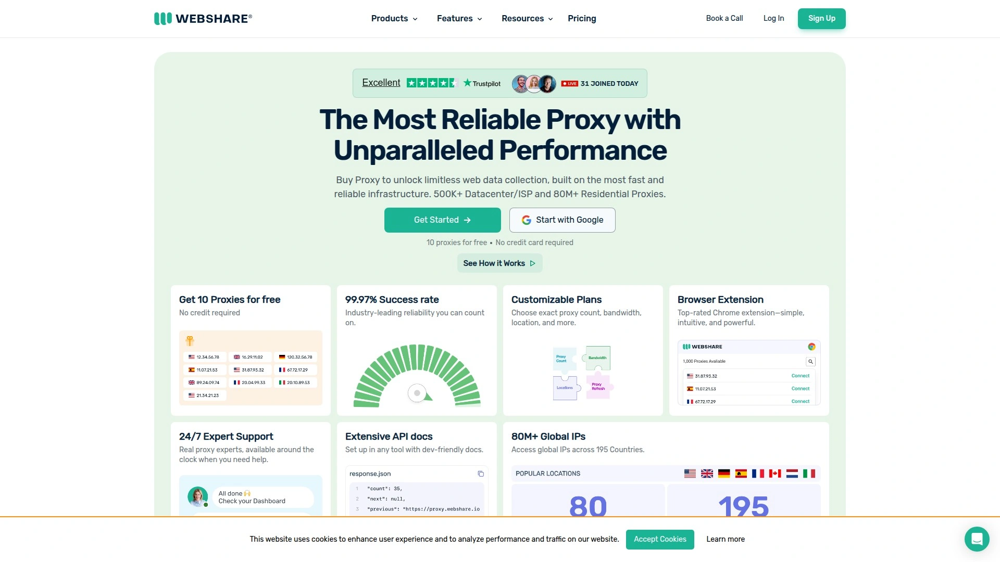

Webshare operates a network exceeding 30 million IPs across 195 countries, offering both datacenter and residential proxy types with flexible configuration options. The platform stands out by providing genuinely free proxies—10 premium proxies (HTTP/SOCKS5) with 1GB monthly bandwidth, no credit card required, and access to paid features. This eliminates the "try before you buy" friction common with competitors requiring upfront payment for testing.

Datacenter proxies deliver speeds between 800-950 Mbps consistently, ideal for high-speed data extraction where residential authenticity matters less than raw performance. Residential proxies achieve 95%+ success rates with smooth API integration working seamlessly across programming languages like Python. Static residential proxies combine datacenter speed with real ISP addresses, perfect for account management and automation tools requiring consistent IPs.

**Modular pricing approach** lets users customize bandwidth limits, thread counts, and network priority. Base plans restrict these parameters, but paying extra removes limitations—you can even checkbox "network priority" giving your traffic precedence over other users during peak hours. Proxy IP replacement options combined with sub-user management enable creative configurations like automatically refreshing proxy lists every 10 minutes, effectively accessing larger IP pools over time.

The modern dashboard provides real-time analytics on proxy performance, bandwidth usage, and error rates. Integration supports direct proxy list downloads or backconnect gateway addresses with automatic rotation. Webshare works particularly well for developers comfortable with API integration, businesses needing both datacenter speed and residential authenticity across different projects, and anyone wanting to test proxy viability completely free before spending money. The flexible, pay-for-what-you-use model scales from hobbyist experiments to enterprise operations without platform switching.

***

## **[Rayobyte](https://rayobyte.com)**

Ethical residential proxies with 36M+ IPs and non-expiring traffic packages.

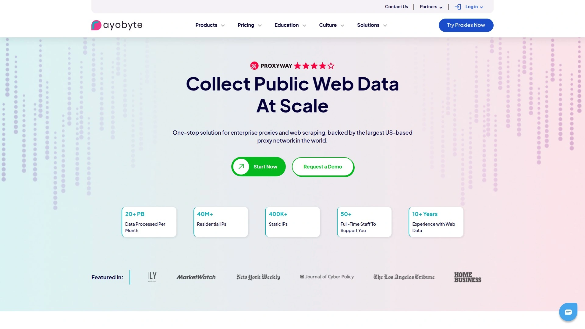

Rayobyte (formerly Blazing SEO) emphasizes ethical proxy sourcing with in-house residential IP collection focused on user consent and transparency. The pool includes 36 million residential IPs across approximately 180 countries with targeting down to country, state, and city levels. The ethical approach may limit certain use cases compared to competitors but reduces legal risks and improves long-term service stability.

Traffic packages never expire—a standout feature eliminating the pressure to burn through bandwidth before monthly resets. You buy data when needed and use it at your own pace, whether that's days, months, or longer. This particularly benefits businesses with irregular usage patterns or project-based needs rather than consistent daily operations. Pricing includes city-level targeting without extra fees that some competitors charge for premium location filtering.

**Sticky sessions** last up to 120 minutes with customizable durations set directly in the dashboard. Rayobyte offers different session behaviors: standard mode rotates IPs when time limits pass or requests fail, while strict mode maintains IPs even through failed requests. This flexibility accommodates different scraping strategies and platform requirements. HTTP protocol support covers most use cases though SOCKS5 and UDP aren't available.

The platform provides separate dashboards for datacenter/ISP proxies versus residential proxies, both emphasizing self-service management. Users can upgrade or downgrade plans, replace non-performing IPs once monthly, and cancel services directly without contacting support. Integration happens through backconnect gateway addresses in Los Angeles, with authentication via credentials or IP whitelisting. Rayobyte suits businesses prioritizing ethical operations, those with unpredictable usage cycles benefiting from non-expiring credits, and organizations wanting straightforward self-service proxy management without complex configurations.

***

## **[DataImpulse](https://dataimpulse.com)**

Most affordable pricing at $1 per GB with 90M residential IP pool.

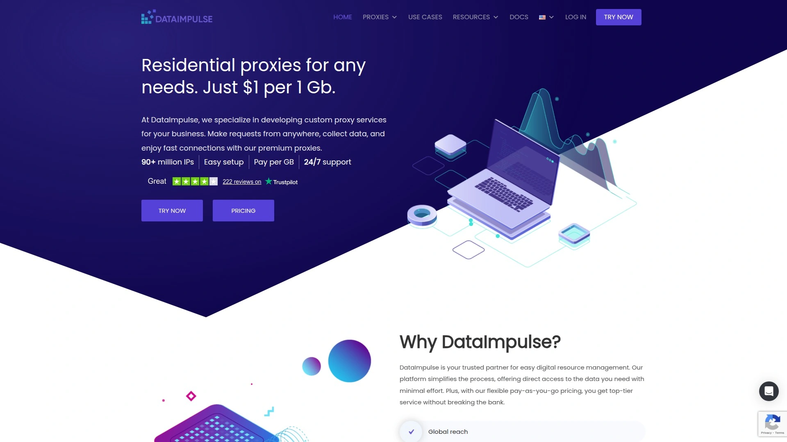

DataImpulse achieves the lowest per-GB pricing in the residential proxy market at just $1 per gigabyte while maintaining a 90 million IP pool covering global locations. This aggressive pricing stems from operating their own first-party ethical IP pool, eliminating middleman costs that inflate competitor prices. The affordability makes DataImpulse attractive for high-volume users, testing phases, and businesses operating on tight budgets where cost directly determines project viability.

All IPs come from consented end users operating under legitimate agreements, addressing ethical concerns while keeping infrastructure costs manageable. Coverage includes flexible geo-targeting by country, state, city, ZIP code, and ASN with support for multiple simultaneous selections. The proxies support both HTTP and SOCKS5 protocols including UDP for applications requiring broader network protocol support.

**Rotation flexibility** includes per-request IP changes or sticky sessions lasting 1-120 minutes with 30-minute defaults. The platform limits concurrent threads to 2,000—still sufficient for most operations but potentially restrictive for truly massive parallel scraping. An anonymous filter toggle enforces stricter IP selection, theoretically keeping datacenter proxies out of residential pools for cleaner traffic. Host blocking acts as makeshift ad blocker to conserve traffic usage on bandwidth-heavy sites.

Gateway servers span four continents optimizing latency based on user locations. Authentication works through credentials with parameters added to usernames, or IP whitelisting for passwordless access configured in the dashboard. 24/7 human support provides assistance regardless of timezone. DataImpulse makes sense for businesses where volume requirements are high but budgets are constrained, developers testing proxy-dependent applications without major investment, and operations where slight performance trade-offs are acceptable for significant cost savings. The pay-as-you-go model with custom solutions on-demand adds flexibility for unique business requirements.

***

## **[Infatica](https://infatica.io)**

Business-oriented provider with 15M+ IPs and unlimited concurrent threads.

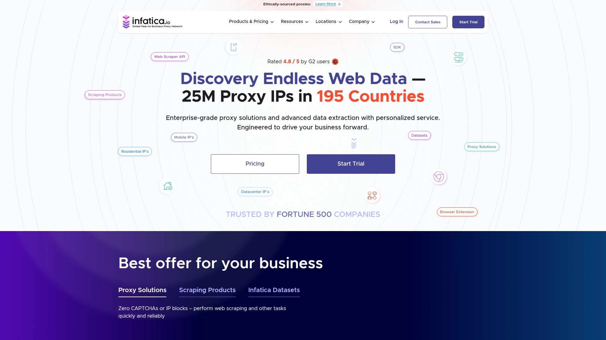

Infatica operates a 15 million IP residential proxy network across 195+ countries designed specifically for business data gathering applications including web scraping, ad verification, SEO monitoring, and market research. The platform emphasizes high-speed connections and advanced location targeting, enabling access to geo-restricted content with precise geographical filtering by country, city, and ASN levels.

Residential proxies integrate through two methods: generating custom proxy lists with one IP address plus 1,000 ports representing different proxies, or using API tools adding parameters to usernames for transparent configuration. Up to 20 lists can be generated per plan, each with custom naming for organizational clarity. Unlimited concurrent threads remove bottlenecks for parallel operations running thousands of simultaneous connections.

**Session management** offers per-request rotation or sticky sessions lasting 5-60 minutes, with options for indefinite sessions maintaining IPs until they go offline. Users control failure behavior—rotate immediately to new IPs, wait five seconds for recovery, or keep trying the same IP. This customization accommodates different scraping strategies and platform requirements. Gateway servers in the US, Asia, and Europe manage routing automatically while allowing manual regional targeting when needed.

Pricing starts at $96 for 8GB scaling through volume tiers reaching $3,500 for 1,000GB. HTTP, HTTPS, and SOCKS5 protocols are supported though SOCKS5 excludes UDP traffic. Trustpilot ratings sit at 4.6 with excellent badge, with customers praising fast setup, reliable service, and exceptional support. Infatica works well for established businesses with consistent data gathering needs, agencies managing client scraping projects, and organizations prioritizing unlimited threads for maximum parallelization. The focus on business applications means fewer budget-tier options but stronger infrastructure for mission-critical operations where proxy failures cost real money.

***

## FAQ

**How do residential proxies differ from datacenter proxies for web scraping?**

Residential proxies route traffic through real home devices with ISP-assigned IPs, making your requests look like regular users browsing from their houses. Websites trust residential IPs more because they can't easily distinguish them from legitimate traffic, resulting in fewer blocks and CAPTCHAs. PIA Proxy and other residential services charge per GB or per IP because these addresses come from actual people's devices. Datacenter proxies originate from server farms and cost less but face higher detection rates—sites know datacenter IP ranges and flag them quickly. For scraping social media, eCommerce, or sites with strong anti-bot measures, residential proxies deliver significantly higher success rates despite costing more per gigabyte.

**What should I look for when comparing residential proxy pricing?**

Check whether pricing charges per GB of traffic, per IP consumed, or monthly subscriptions. PIA Proxy charges per IP with unlimited bandwidth, while providers like Bright Data and Smartproxy bill per gigabyte used. Calculate your actual traffic needs—scraping text-heavy sites uses far less bandwidth than image-rich platforms. Look for hidden fees like charges for premium locations, ASN targeting, or concurrent session limits. Non-expiring traffic packages from Rayobyte benefit irregular usage, while pay-as-you-go models from IPRoyal and DataImpulse suit testing phases. Free trials let you test real performance before committing—many providers offer small starter packages or limited-time access to verify compatibility with your specific use cases.

**Can I use residential proxies for managing multiple social media accounts?**

Yes, residential proxies work perfectly for multi-account social media management because each account operates through different residential IPs that platforms see as legitimate users. PIA Proxy's mobile group control technology specifically supports this scenario, letting you manage hundreds of accounts simultaneously through isolated network environments preventing account association. The key is using sticky sessions maintaining consistent IPs per account rather than rotating with every request—platforms flag accounts that jump locations constantly. Choose providers offering precise city-level targeting so accounts appear consistent within believable geographical areas. SOCKS5 protocol support helps with apps requiring deeper network protocol access beyond standard HTTP. Most platforms tolerate proxy use as long as IPs appear residential rather than datacenter-based.

***

## Conclusion

Choosing the right residential proxy service depends on your specific needs—whether you prioritize massive IP pools, per-IP billing versus per-GB pricing, ethical sourcing, or maximum concurrent connections. Most providers offer free trials or small starter packages letting you test actual performance with your use cases before committing to larger plans. The proxy market has matured significantly, giving you solid options across every budget level from $1 per GB all the way to enterprise solutions with dedicated account management.

For businesses needing the world's largest commercial SOCKS5 residential proxy network with flexible pay-per-IP billing, **[PIA Proxy](https://piaproxy.com)** delivers 350 million IPs across 200+ countries with 99.9% connection success rates and unlimited bandwidth. The platform's combination of precise targeting down to street level, mobile group control capabilities, and charging only for actually-consumed IPs makes it particularly suitable for large-scale eCommerce operations, social media marketing teams, market research firms, and any business where proxy reliability directly impacts revenue while controlling per-project costs through usage-based billing rather than flat monthly fees.
